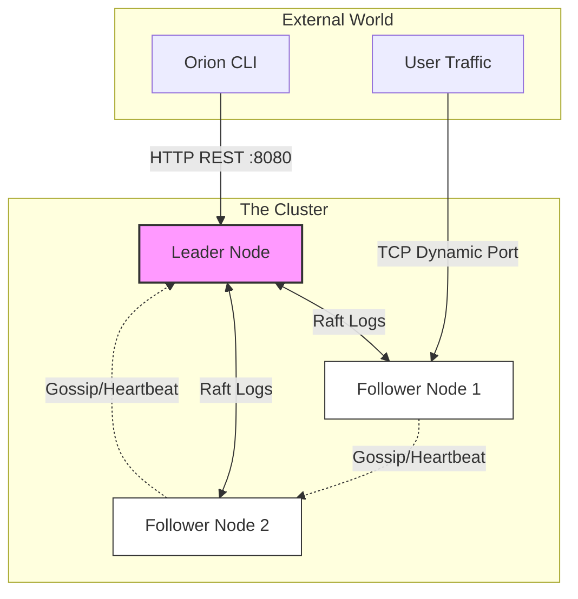

## Product Requirements Document (PRD)

| Field | Value |
| :--- | :--- |
| **Project** | **Orion** (Distributed Container Orchestrator) |
| **Version** | **v0.1.0-alpha** (The "Scheduler" Release) |
| **Owner** | Aditya Mishra (`@bit2swaz`) |
| **Status** | **READY FOR DEV** |
| **Core Principle** | "Complexity Collapse" — A complete cluster in a single binary. |
| **Tech Stack** | Go, Docker Engine API, HashiCorp Raft, HashiCorp Memberlist, Boltdb |

-----

### 1\. Executive Summary

#### 1.1 The Concept

**Orion** is a distributed system that abstracts a fleet of Linux servers into a single logical computer. It accepts a "Job" (Docker Image + Config) and ensures it runs *somewhere*, regardless of hardware failures.

#### 1.2 The "Senior Engineer" Value Proposition

Unlike Kubernetes, which separates control plane and workers, **Orion** uses a **symmetric architecture**.

  * **Zero-Config:** Nodes auto-discover via Gossip (SWIM protocol/Lifeguard).
  * **Strong Consistency:** State is managed via Raft consensus (embedded).
  * **Smart Scheduling:** Tasks are placed based on hardware constraints (RAM/CPU) and topological tags.
  * **Service Discovery:** Dynamic Port Mapping ensures no port conflicts across the cluster.

-----

### 2\. High-Level Architecture

Orion runs on two networking planes:

1.  **Control Plane (TCP 7946):** Raft Consensus (Strong Consistency) for storing state.
2.  **Gossip Plane (UDP/TCP 7947):** Memberlist (Eventual Consistency) for health checks.

#### 2.1 Cluster Topology



#### 2.2 The Node Internal Anatomy

Every Orion binary contains these specific subsystems. The **Role** (Manager vs Worker) determines which subsystems are active.

```mermaid
graph TD
    subgraph "Orion Binary"
        API[API Server (Gin)]
        CLI_CMD[CLI Handler]
        
        subgraph "Core Domain"
            Orch[Orchestrator]
            Scheduler[Constraint Solver]
            FSM[Finite State Machine]
        end
        
        subgraph "Adapters"
            Docker[Docker Runtime]
            Raft[Raft Consensus]
            Gossip[Memberlist Discovery]
        end
    end

    API --> Orch
    CLI_CMD --> API
    Orch --> Scheduler
    Orch --> FSM
    FSM --> Raft
    Raft --> FSM
    Orch --> Docker
    Gossip --> Orch
```

-----

### 3\. Detailed Functional Specifications

#### 3.1 The "Brain": Distributed Consensus (Raft)

We embed the database within the application logic.

  * **Library:** `hashicorp/raft` + `boltdb`.
  * **The Log:** A sequential list of operations.
      * `OP_SCHEDULE_TASK`: User wants to run Nginx.
      * `OP_NODE_JOIN`: A new server joined.
  * **The FSM (Finite State Machine):**
      * When the Raft log commits an entry, the `Apply(log)` function updates the internal state.
      * **Crucial:** Every Manager node has an identical copy of the "Desired State."

#### 3.2 The "Heartbeat": Gossip Protocol (Lifeguard Enabled)

  * **Library:** `hashicorp/memberlist`.
  * **Mechanism:** Randomized "Infection" style (SWIM).
  * **Lifeguard Enhancements:**
      * **LHA-Probe:** Dynamic probe timeouts based on local health to prevent "Flapping."
      * **Buddy System:** Suspicions are sent to the target node first to allow rapid refutation.
  * **Failure Detection:** If Node A suspects Node B is dead, and Node C confirms it, Node B is marked `Down`.

#### 3.3 The "Muscle": Worker & Runtime

  * **Library:** `docker/client` (Docker Engine API).
  * **Networking Strategy:** **Dynamic Port Mapping.**
      * Worker does *not* use Overlay networks.
      * Worker starts containers binding `ContainerPort:80` to `HostPort:32xxx`.
      * Worker reports the `HostPort` back to the Manager so it can be displayed in the CLI.

#### 3.4 The "Judge": The Constraint-Aware Scheduler

The Scheduler determines *feasibility* before *optimality*.

  * **Input:** `Task` (Req: 1GB RAM, Tag: "ssd")
  * **State:** List of Nodes + Capacity Snapshots.
  * **Algorithm (Filter & Score):**
    1.  **Filter:** Eliminate nodes with insufficient RAM/CPU or mismatched Tags.
    2.  **Filter:** Eliminate nodes where the requested host port is already taken (if static).
    3.  **Score:** Rank by `(Weight * FreeResource)`.
    4.  **Assign:** Select Node, assign a random open Port (if dynamic), return assignment.

-----

### 4\. Data Structures

#### 4.1 The Task (Unit of Work)

Updated to support Dynamic Port Mapping.

```go
type Task struct {
    ID            uuid.UUID
    Name          string
    Image         string
    
    // Resource Constraints
    Memory        int64  
    Disk          int64 
    Cpu           float64 
    
    // Topology Constraints
    NodeSelectors map[string]string 

    // Networking
    ExposedPorts  nat.PortSet // Container Ports (e.g., "80/tcp")
    PortBindings  map[string]string // Assigned Host Ports (e.g., "80/tcp" -> "32001")

    // Orchestration Status
    NodeID        string 
    State         TaskState
    StartTime     time.Time
}
```

#### 4.2 The Node (The Infrastructure)

```go
type Node struct {
    ID            string
    IP            string
    Role          string // "manager" or "worker"
    
    // Capacity Tracking
    MemoryTotal   int64
    MemoryUsed    int64
    CpuTotal      float64
    CpuUsed       float64
    
    // Metadata
    Tags          map[string]string
}
```

-----

### 5\. Failure Modes & Recovery Strategies

#### Scenario A: The Split Brain (Trap B)

1.  **Event:** The Leader gets partitioned from the network but doesn't know it yet.
2.  **Risk:** The Old Leader tries to schedule tasks while a New Leader is elected elsewhere.
3.  **Fix:** The `ReconciliationLoop` explicitly checks `if Raft.State() != Leader { return }` before performing *any* write actions or Docker calls.

#### Scenario B: Worker Node Failure

1.  **Event:** Worker Node X dies.
2.  **Detection:** Lifeguard/Memberlist marks Node X as `Dead`.
3.  **Reaction:**
      * Leader queries Store for tasks on Node X.
      * **Reschedule:** Tasks set to `Pending`. Scheduler runs again, finding new homes.

-----

### 6\. Deployment Strategy (Dev Environment)

We use `make` to simulate a heterogeneous cluster on your machine.

  * **Node 1 (Leader):** "Large" Node (Simulated 32GB RAM).
  * **Node 2 (Worker):** "Small" Node (Simulated 4GB RAM).
  * **Node 3 (Worker):** "GPU" Node (Tagged `gpu:true`).
